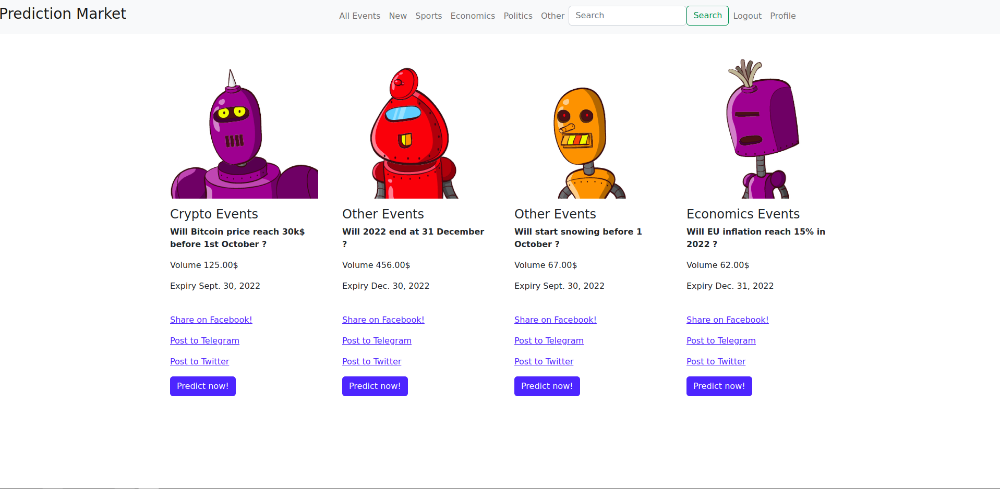
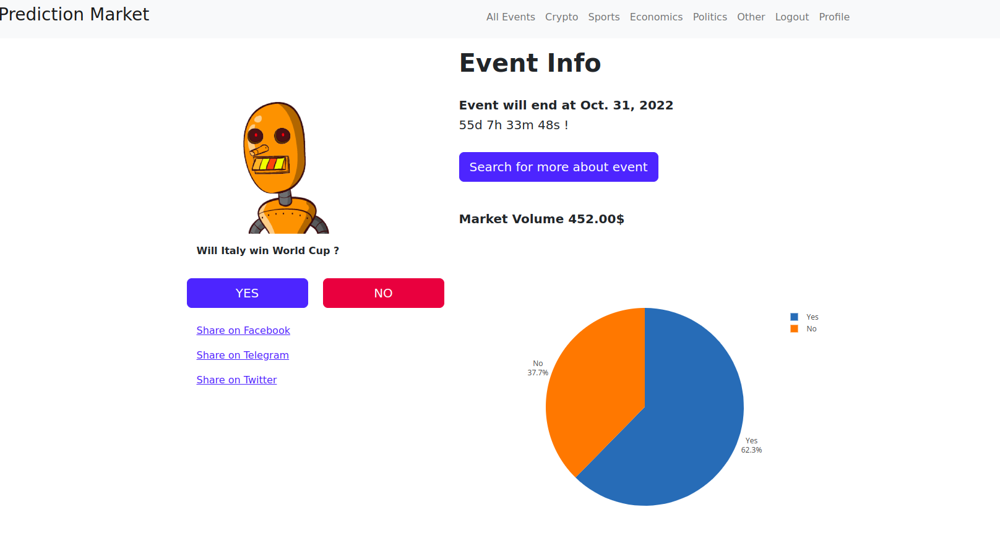
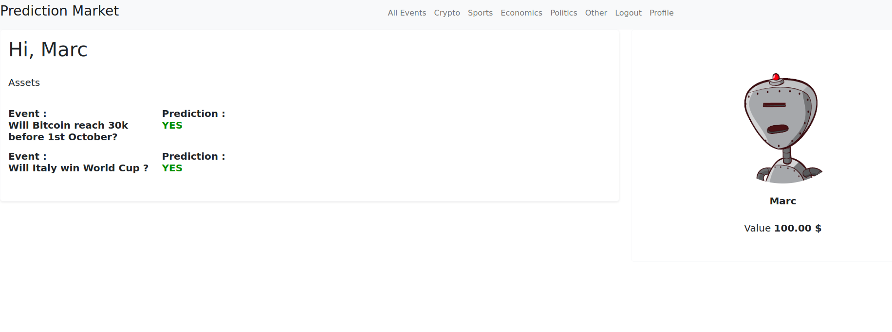

# Prediction market with Django

## Table of contents

* [General Info](#General-Info)
* [Tech Stack](#Tech-Stack)

## General Info

The project allows users to bet on future events. Rules are very simple.
The user has to answer the following: Will a specific event happen before the date?
Options are Yes or No.

## Tech Stack

* Python
* Django
* PostgreSQL
* HTML/CSS
* Pytest
* javascript
* More with project increment

## Home Page

## Event Page

## Profile Page

